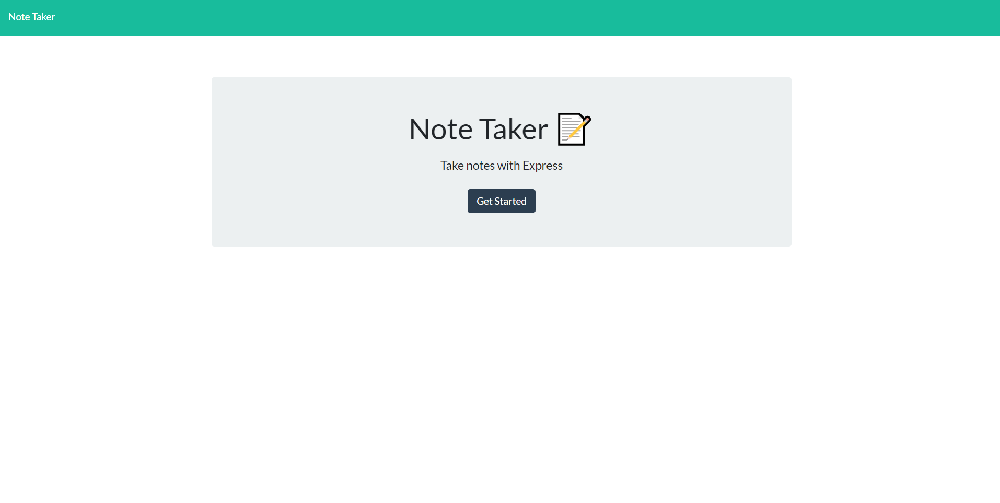
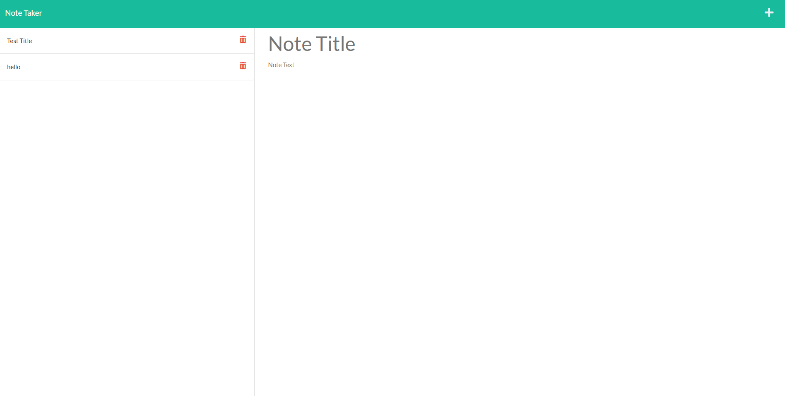

# Note Taker 
## User Story

```
AS A small business owner
I WANT to be able to write and save notes
SO THAT I can organize my thoughts and keep track of tasks I need to complete
```

## Acceptance Criteria

```
GIVEN a note-taking application
WHEN I open the Note Taker
THEN I am presented with a landing page with a link to a notes page
WHEN I click on the link to the notes page
THEN I am presented with a page with existing notes listed in the left-hand column, plus empty fields to enter a new note title and the note’s text in the right-hand column
WHEN I enter a new note title and the note’s text
THEN a Save icon appears in the navigation at the top of the page
WHEN I click on the Save icon
THEN the new note I have entered is saved and appears in the left-hand column with the other existing notes
WHEN I click on an existing note in the list in the left-hand column
THEN that note appears in the right-hand column
WHEN I click on the Write icon in the navigation at the top of the page
THEN I am presented with empty fields to enter a new note title and the note’s text in the right-hand column
```

## Intructions

```
1. Run npm install in command line to install dependencies
2. Run npm start in command line to start application
3. User is presented with the home page which contains a button that leads to the page that adds notes
4. User can add a title and text and save note to the side pannel
5. Although at the moment, user cannot delete the items using the delete button
```

## Heroku deployed link

```
https://note-taker123412.herokuapp.com/notes
```

## Photos of pages this project contains
-----


-----
